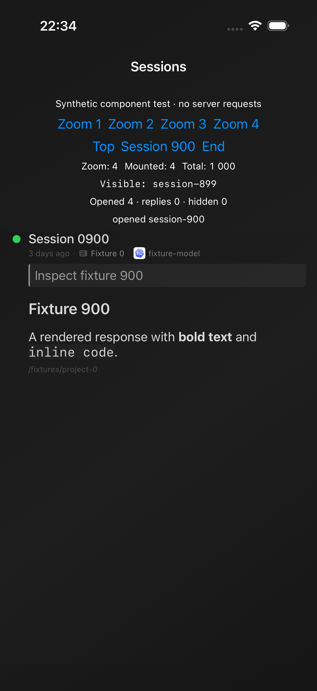

# Performance validation

This is a measurement record for the performance work based on `a2f39d17`, recorded
on 2026-09-24. The measurements span successive commits on `perf/measured-mobile-host`;
individual results below identify their scope and whether later changes supersede them. The results establish specific improvements and regression coverage; they do
not establish production startup latency, a percentile ranking, or absence of all
memory and storage leaks. Native functional suites passed. Partial iOS simulator
manual acceptance is recorded below; physical-device and broader manual
production-app acceptance remain pending.

## Session derivation: isolated host microbenchmark

The baseline and candidate compile the production `SessionsTypes.swift` and
`SessionsDerivation.swift` with Apple Swift 6.2 and `swiftc -O` on Apple Silicon.
Value-only declarations extracted from the generated UniFFI Swift bindings retain
the actual 624-byte `AppSessionSummary` stride. This experiment does not call Rust,
load the application, render UI, or contact a server.

Each fixture contains one parent and either 100 or 1,000 child sessions in one
workspace, with distinct timestamps. Each process performs seven derivations and
verifies a selected child's sibling projection after each timed derivation. The
timer includes the baseline's eager sibling construction; the candidate's selected
sibling projection happens outside the timer. `/usr/bin/time -l` captures whole
process maximum resident memory, including those sibling reads. Concurrent host
work caused substantial variation, so these samples are diagnostic rather than
device latency budgets or percentile estimates.

| Children | Baseline median ms (min–max) | Candidate median ms (min–max) | Baseline maximum RSS | Candidate maximum RSS |
| --- | --- | --- | --- | --- |
| 100 | 11.216 (2.270–62.911) | 3.207 (1.976–32.865) | 25,477,120 B | 11,173,888 B |
| 1,000 | 684.420 (475.308–848.640) | 20.865 (11.795–62.692) | 854,589,440 B | 28,835,840 B |

At 1,000 children, median derivation duration fell by approximately 32.8 times and
peak process RSS fell by 96.6% in this experiment. Retained lineage array entries
fell from 1,000,000 to 1,000: the candidate stores children once and derives siblings
when requested. These are exact logical element counts, not allocator counts. The
corresponding summary payload lower bound is 624 MB versus 0.624 MB; other linear
projections remain allocated.

Local diagnostic evidence is under
`artifacts/performance-steward/session-derivation/`: exact before/after source
copies, extracted types, fixture runner, JSON results, resource reports, and host
regression output. Those generated artifacts are not part of the public source
tree. The committed regression fixture is
`apps/ios/Tests/LitterTests/SessionsDerivationTests.swift`.

## iOS viewport component measurements

The completed `ios-focused-3` run used a Debug arm64 iOS simulator build with the
iOS 26.0 SDK. It passed 26 tests with zero failures in 4.790 seconds of test time:
14 home dashboard support tests, four session derivation tests, three viewport
geometry tests, four viewport scalability tests, and one model lifecycle test.
This run preceded the final pinch anchoring and idle animation fixes; it is not
acceptance of the final candidate.

| Operation | Fixture and sample count | Observed duration |
| --- | --- | --- |
| Initial viewport creation and apply | 1,000 synthetic sessions, 390 × 800 view, zoom level 2, ten XCTest samples | Mean 30.732 ms; 29.337–32.557 ms |
| Visible range lookup batch | 1,000 lookups into 100,000 fixed-height frames per sample, ten XCTest samples | Mean 1.411 ms per batch; 1.323–1.931 ms |

The mount measurement includes view construction, layout, apply, and its bounded
mount assertion. Fixture construction is outside the timed block. The lookup
measurement includes XCTest assertions and excludes frame-array construction.
Neither result measures a display frame, input-to-presentation latency, navigation,
network hydration, or app launch. There is no matched native baseline for these
two measurements.

The completed tests verify that a 1,000-session list mounts fewer than 50 rows at
initial zoom 2, releases an offscreen hosting tree, reaches the final row, and clears
rows for an empty list. All four zoom levels retain bounded mounts. Page-fit zoom
retains the complete 800,000-point content extent with at most three mounted rows
in its fixture. These bounds apply to the tested viewport and fixture, not every
device size or text setting.

Four subsequent geometry regressions passed in an isolated host harness using the
production geometry helper and minimal value types: deep pinch page-fit anchoring,
different pinch finger positions, offscreen height invalidation, and insertion or
reordering above the viewport. Swift preconditions replace XCTest in that harness;
the native versions and final idle-animation regression subsequently passed in
the combined run recorded below.

## Manual component harness and current acceptance

Debug builds accept `--ui-test-home-sessions`. The harness embeds the production
`HomeSessionsScrollView` with 1,000 synthetic sessions, four zoom controls, deep
scroll actions, mounted-row counters, swipe callbacks, and a local detail screen
with native Back navigation. It exercises the component; it does not exercise the
real conversation transport, hydration, or production navigation teardown.
`HomeSessionsUITests` covers deep row opening and Back at every zoom, pinch, swipe,
scroll movement, and bounded mounts.

The first UI run exposed continuously paused pinch-blur animators on idle rows,
causing XCTest animation-idle waits. Idle rows now create those animators only when
needed and dispose of them after the gesture. A regression covers newly mounted,
reattached, and accessibility-updated idle rows. The subsequent native functional run passed the plain pinch/swipe/scroll test
and deep-row open/Back tests at all four zoom levels. The interrupted first run
is not a pass or a usable navigation timing measurement.

`MobilePerformanceUITests.testMainHomeLaunchPerformance` adds a separate launch
measurement with no fixture flags or preference overrides. It records XCTest's
first-frame/main-thread-responsive launch metric and wall time through a hittable
Home Settings control. Run it on a dedicated simulator without a restored
conversation. It never clears user data. Repeated launches retain OS caches and
must not be described as cold-install measurements.

The four `testHomeSessionsOpenBackResourcesZoom*` tests each record five measured
samples plus XCTest's discarded warm-up. Each sample performs two open/Back cycles
at session 900 using the synthetic production-viewport harness. App-process CPU
and memory metrics exclude launch, zoom setup and deep scrolling; wall duration
includes event injection, idle waits and assertions. The app stays alive across
samples. The `46a0acbb` simulator binary passed all five resource tests (four zoom levels
and normal Home launch). Each row below is the mean of five measured samples,
with one discarded warm-up; each navigation sample contains two open/Back cycles.

| Zoom | App CPU time per sample | Absolute physical memory | Peak physical memory | Automated wall duration |
| --- | --- | --- | --- | --- |
| 1 | 4.880 s | 198.65 MB | 203.28 MB | 13.561 s |
| 2 | 3.146 s | 144.98 MB | 148.93 MB | 11.914 s |
| 3 | 2.008 s | 126.69 MB | 128.80 MB | 10.905 s |
| 4 | 1.152 s | 119.34 MB | 120.95 MB | 10.058 s |

Memory units here are decimal MB converted from XCTest kB. Per-sample memory
changes included both increases and decreases; five samples do not establish a
retained-object leak slope. XCTest event injection, accessibility queries, idle
waits and assertions affect these measurements, especially wall duration; they
are not input-to-frame latency or production navigation timing.

The normal Home first-frame-plus-responsive launch metric averaged **2.590 s**
(range 2.560–2.619 s, five samples); automated wall duration through a hittable
Settings button averaged 4.612 s. This is not instant startup and needs further
profiling. The Debug simulator retains OS caches, runs on a shared Mac with an
Android emulator and ordinary user applications, and does not establish physical
device or Release performance. CPU-heavy builds were deliberately paused for the
run. Exact binary UUID, app version/build, host conditions, raw xcresult and
exported metrics are under `artifacts/performance-steward/ios-resource-metrics-46a0acbb*`.
Later source changes, including revisioned streaming and offscreen height
comparison, are excluded from this run; subsequent functional acceptance is recorded below.

The Debug `BackToHomeAppear` signpost measures the actual final conversation Back
callback through the recreated Home view's SwiftUI `onAppear` on compact layouts.
It excludes nested navigation, interactive edge-swipe pop, and split layouts. Its
endpoint is appearance callback delivery, not a displayed frame or touch latency.

The native functional run `ios-final-functional` passed 296 unit tests and 14 UI
tests, with one rich-session pinch failure (310/311 total). This includes native
snapshot-fence, controlled asynchronous AppModel, lifecycle, and compact-lineage
regressions. The rich fixture retains a 1,000-member fork family. Its original
pinch scale 0.7 did not cross the page-fit snap threshold; scale 0.5 corrected the
input, but one subsequent run still failed. Diagnostic repeats then passed,
including two consecutive runs with only terminal gesture-state tracing and no
fixed sleep or hierarchy-dump delay. Both traced recognizer endings committed
zoom 2 from zoom 4, retained session 900, and completed open/Back. No production
gesture semantics changed during this investigation; the intermittent failure
remains unexplained. Whole XCTest durations are not interaction latency.

Android `:app:testDebugUnitTest` passed all 80 tests in 18 suites. Both APK builds
passed, and the rebuilt Rust library was installed on the API 37 arm64 emulator.
The first native instrumentation run passed nine tests and exposed one real
text-selection/link-handling ordering failure. The corrected implementation sets
selectability before restoring link movement handling. A stronger regression
checks link touch dispatch and arbitrary buffer selection across true/false/true
reconfiguration; all ten native instrumentation tests passed after supplying layout parameters
for the standalone test view. The link regression dispatches actual MotionEvents
and selects a buffer range on the main thread; it does not verify attached
long-press selection handles or action-mode presentation. The shared Rust
library suite passed 844 tests with zero failures and three ignored tests, including
idle subscription cancellation, removed-thread cache cleanup, removed-server
launch-row cleanup, and launch-cache projection without cloning conversation history.
This host run precedes the subsequent revisioned streaming change and does not
establish acceptance of that change. Installed native builds have their own test
records and must be rebuilt again when the shared library changes.

An isolated Kotlin 2.0.21/OpenJDK 21 stress harness also ran exact extracted
production Android snapshot/cache projection methods with value-only records and
a volatile flow stand-in. The baseline lost concurrent hydration updates (206 of
800 distinct threads survived that schedule). With the in-memory mutation lock,
eight rounds of eight writers retained all 800 threads, and eight further rounds
with 200 concurrent full-resync merge/prune passes preserved all hydrated payloads.
Authoritative pruning and remove/restore invariants passed. These are correctness
checks, not timing measurements or Android integration tests. Local source copies
and output are under `artifacts/performance-steward/android-projection/`.

## Native revision and animation acceptance

The `65741400` shared library passed 852 Rust tests, with no failures and three
ignored tests. Its regenerated bindings and rebuilt Android library then passed
89 unit tests in 19 suites and 11 emulator instrumentation tests. The latter
include three Activity recreations, native context initialization, transcript
virtualization, selection/link handling and settings navigation. Activity
recreation preserves the same application model; this assertion is not an
authenticated network round trip after recreation.

The iOS `ios-revisions-functional-2` run passed both animation regressions and all
four keyboard-focus regressions. Explicit RGBA copies preserve bundled animation
frame counts, dimensions and timing, with complete pixel comparisons of first,
middle and final frames plus a synthetic transparency fixture. Background frame
preparation measured 10.443 seconds for the entrance and 8.345 seconds for the
loop on this Debug simulator. These timings are diagnostic test observations,
not a matched speedup or launch measurement.

The preceding `46a0acbb` App Launch trace found WebP decoding on the main thread
through Core Animation preparation after the background frame-construction pass.
The candidate materializes independent RGBA bitmap frames before assigning them
to the animation. The frame pixels, resolution and cadence are preserved, with the existing cache
configured for a 96 MiB cost limit. The subsequent
30-second App Launch trace contains no sampled main-thread WebP decoder frames,
compared with 1,725 such rows in the earlier 20-second trace. A separate
45-second Time Profiler capture includes both animation applications at 13.685
and 32.306 seconds, with no sampled main-thread WebP decoding. The latter has
17,940 background WebP CPU samples: background decoding remains expensive.
Trace durations and templates differ; these are stack-location observations, not
an end-to-end speedup or proof that every possible path is free of stalls.

The native run also exposed an on-demand row-height cache bug: measurement before
implicit layout did not record its width, preventing reuse after eviction. The
fix records the width at measurement time and invalidates entries from a previous
width. The focused `33da4e30` rerun passed all nine component tests, including the
original offscreen case and new width-change case, plus all three Home UI
scenarios. The preceding complete run passed 330 of 331 tests, with this
height-cache case as its only failure.

## Updated native resource measurements

The frozen `33da4e30` simulator binary, with shared Rust `65741400`, passed all
five resource tests. This compares two intermediate performance-branch builds;
both already contain viewport virtualization. The same five-sample procedure,
simulator, fixture and Debug configuration were retained, with heavy builds
paused. Ordinary applications and the Android emulator remained running.

| Zoom | App CPU per two open/Back cycles, prior → updated | Updated absolute physical memory | Updated peak physical memory | Updated automated wall duration |
| --- | --- | --- | --- | --- |
| 1 | 4.880 → 4.906 s | 195.66 MB | 199.21 MB | 13.577 s |
| 2 | 3.146 → 3.070 s | 141.35 MB | 143.61 MB | 11.852 s |
| 3 | 2.008 → 1.996 s | 121.37 MB | 124.35 MB | 10.865 s |
| 4 | 1.152 → 1.136 s | 115.32 MB | 116.89 MB | 10.016 s |

Navigation CPU is broadly unchanged and memory is modestly lower; no statistical
significance or general navigation speedup is claimed from these five samples.
The responsive first-frame launch metric averaged **2.290 s** (2.241–2.343 s),
versus 2.590 s previously, an observed 11.6% reduction. Wall duration through
hittable Settings averaged 4.574 s versus 4.612 s. Multiple source changes and
uncontrolled host activity prevent attributing this difference to one fix. This
still does not qualify instant launch or physical-device Release performance.
Raw xcresult, metrics, sample-by-sample comparison and traces are under
`artifacts/performance-steward/ios-resource-metrics-33da4e30*`,
`ios-native-metrics-comparison.json`, and `ios-full-animation-33da4e30*`.

Android diagnostics used the current Debug APK on the API 37 arm64 emulator.
Five force-stop/launch attempts all returned `Status: ok`. ActivityManager labeled
four COLD, with display-reporting durations 1,669, 1,610, 1,762 and 1,740 ms
(median 1,704.5 ms), and one WARM at 1,873 ms; the labels are preserved rather
than treating all attempts as cold. These are display-reporting times, not
interactive readiness. A separate 15.301-second post-launch observation used
5.44 process CPU seconds (35.55% of one core); RSS rose from 363,216 to
378,640 KiB. This startup-adjacent window is not a steady-state leak measurement.
The foreground route could not be visually verified because native screen capture
failed, so these results are labeled MainActivity diagnostics, not accepted Home
interaction measurements. A pilot launch batch overlapping trace export was
excluded; the reported launch batch ran without other heavy profiling or builds.
Evidence and exact collection scripts are under
`artifacts/performance-steward/android-measure/`.

A subsequent 19.832-second Android `simpleperf` capture recorded 700 user-space
task-clock samples with none lost (3.518 sampled CPU seconds). The main thread
accounted for 50.29%, RenderThread 32.43%, and AnimatedImageThread 9.71% of the
sampled event count. Inclusive stacks identified onboarding arrow drawing and
path construction, status-dot recomposition, and animated WebP decoding. These
percentages divide sampled CPU work, not elapsed time; they exclude kernel work
and do not identify a leak. The exact recording and reports are under
`artifacts/performance-steward/android-cpu/`.

After `3307e89f` cached static coachmark paths and deferred status-dot state reads
to drawing/layer updates, a quiet 19.845-second capture recorded 526 samples with
none lost (2.643 sampled CPU seconds, versus 3.518 previously). Main-thread sampled
CPU was 1.382 versus 1.769 seconds; RenderThread was 0.879 versus 1.141 seconds.
The previously prominent path-construction and dot-composition methods no longer
appear above the report's 1% threshold. This is a diagnostic before/after capture,
not a randomized comparison or visual acceptance; JIT and process age differ.
The same animation timings, colors and geometry remain in source.

The candidate's five force-stop launches were all labeled COLD: 1,819, 1,800,
1,714, 1,590 and 1,715 ms (median 1,715 ms), so there is no observed startup
improvement here. Its subsequent 15.240-second observation used 4.16 process CPU
seconds (27.30% of one core), versus 5.44 in the earlier 15.301-second window.
RSS rose from 362,736 to 375,568 KiB. These short startup-adjacent observations
remain insufficient for a leak claim. All 91 Android unit tests and 11 native
instrumentation tests passed with the rebuilt retention library; packaged JNI
bytes match the current merged and stripped build outputs.

## Bounded inactive transcript memory

Commit `6e5855a4` introduces a shared Rust retention policy, documented in
[`inactive-history-cache.md`](inactive-history-cache.md). Eligible inactive
transcript capacity exceeding 64 MiB is trimmed toward 48 MiB in least-recently-used
order. Active work, unfinished tools, pending input/approvals, offline servers and
in-flight history reads remain protected. This is a soft budget for eligible
transcripts, not a total app memory limit. An online-evicted history requires its
server to reload; if the connection subsequently drops, that history is unavailable
until reconnection.

Selection schedules trimming off the caller's thread. Large evicted buffers are
released outside the canonical state lock. Revisioned native updates clear the
corresponding renderer caches and preserve the authoritative pagination state.
The final host suite passed 863 tests, with zero failures and four ignored tests,
including cancellation, automatic final-lease release, late tool completion,
reconnect, reload and stale-snapshot regressions. A separate host contention
diagnostic selected threads 4,310 times while trimming 128 MiB of reserved
capacity: p99 was 1 microsecond and the maximum 850 microseconds. Those numbers
measure that host lock path, not device interaction latency. The rebuilt library
subsequently passed both native platforms' suites described below.

## Lossless animation encoding

Commit `cf08e47f` replaces the two iOS home WebPs with APNGs encoded from the
current assets. All 285 composited frames matched their originals pixel for
pixel in an isolated ImageIO experiment, including alpha, canvas dimensions and
color-space identity. Exact 1/15-second frame delays preserve the 11-second
entrance and 8-second loop. Historical APNG assets were rejected because their
pixels differ from the current design.

Changing ImageIO cache hints did not materially improve the original decoder:
preparing owned RGBA frames took approximately 10.7 seconds for the entrance and
7.5 seconds for the loop on the host. The equivalent APNGs took 0.185 and 0.152
seconds in one fresh-process observation each; combined CPU time was 0.330 seconds.
These are host decode observations, not mobile launch measurements. Native
all-frame comparisons subsequently passed.

The tradeoff is explicit: combined source assets grow from 4,679,510 to 21,614,000
bytes, an increase of 16.15 MiB. Logical owned RGBA pixel storage remains approximately
79.29 MiB, with the same existing cache limit. No memory reduction is claimed.
Original WebPs remain Android resources and test-only iOS references, not
duplicate shipping iOS assets. `tools/scripts/convert-home-animations.py` and
its ImageIO helper reproduce the conversion and validate every frame. Experiment
inputs, per-frame hashes, timing data and caveats are under
`artifacts/performance-steward/imageio-cache/`.

The subsequent completion fix retains the final entrance frame during the
immediate same-view replacement load. Generation and view-identity guards reject
stale decode and Core Animation completion callbacks. Interrupted replacements
still clear their image. Five native regressions cover the transition and
cancellation contract. The combined `6368f710` native run passed all **338 tests**:
323 unit tests and 15 UI tests, with zero failures or skips. This includes all
285 animation frame comparisons, the five transition regressions, retention
pagination fences, keyboard focus/input, large-session pinch/swipe/Back, transcript
follow-ups and settings navigation. Entrance and loop preparation took 0.195 and
0.147 seconds in the native pixel test; comparison against the old WebPs is outside
those preparation timers. The earlier simulator tests measured 10.443 and
8.345 seconds with WebP input. These test observations are not launch timing.

The annotation-only `a9f65dbd` follow-up explicitly marks the pure decoder helpers
as nonisolated and their immutable output as Sendable. All seven focused native
animation tests passed again after that rebuild.

A fresh 45-second Time Profiler capture of `a9f65dbd` found 377 background samples
inside the home animation decoder helpers, versus 17,989 background bitmap-helper
samples in the prior WebP capture. The first animation apply was sampled at
3.451 seconds, versus 13.685 seconds previously; the second decode wave finished
by 14.622 seconds. No main-thread PNG or WebP decoder stack was sampled. The
second apply was too brief to appear in this sample capture, so its exact time is
not established. Total main-thread sample counts were higher (6,547 versus 5,593);
the animation is applied earlier and can run for more of the observation
window. This is not an overall main-thread CPU reduction claim or first-frame
metric. Raw traces and summaries are under
`artifacts/performance-steward/ios-full-animation-a9f65dbd*`.

## Final simulator resource measurements

The final `a9f65dbd` simulator binary passed all five resource tests using the
same Debug simulator and five-sample procedure described above. Navigation uses
the synthetic production viewport; normal Home launch uses no fixture flags.
Comparison with `33da4e30` is between two already-virtualized intermediate
and final candidates, not against the original unoptimized app. Runs were
sequential, not randomized; ordinary host applications and the Android emulator
remained present. These measurements do not establish physical-device or Release
performance.

| Zoom | App CPU per two open/Back cycles, prior → final | CPU change | Final absolute physical memory | Final peak physical memory | Final automated wall duration |
| --- | --- | --- | --- | --- | --- |
| 1 | 4.906 → 5.154 s | +5.07% | 191.19 MB | 195.75 MB | 13.699 s |
| 2 | 3.070 → 3.260 s | +6.19% | 143.04 MB | 146.36 MB | 11.967 s |
| 3 | 1.996 → 2.077 s | +4.05% | 119.07 MB | 121.22 MB | 10.899 s |
| 4 | 1.136 → 1.136 s | unchanged (+0.002%) | 111.31 MB | 113.44 MB | 9.984 s |

Navigation CPU increased at zooms 1–3; the faster animation decoder does not
establish a general navigation improvement. Retired instruction counts changed
by +0.07%, −0.07%, +0.56%, and −0.26% at zooms 1–4, while measured CPU cycles
rose by 5.64%, 8.39%, 7.71%, and 7.06%. More cycles per retired instruction is
observed here, but these counters do not determine whether application/cache
behavior or host conditions caused it. They do not rule out an application
regression. Memory changes were mixed, including an increase at zoom 2; five
samples cannot establish a retained-memory leak slope.

Responsive first-frame launch averaged **2.513290 s**, versus **2.290224 s** in
`33da4e30`: an observed **9.74% regression**. All five samples are retained
(range 2.414316–2.851118 s). Automated wall duration through hittable Settings
averaged 4.774152 s versus 4.573978 s (+4.38%). No startup improvement or instant
launch is claimed for the final candidate. The large reduction in animation
preparation cost and absence of sampled main-thread decoder stacks remain
separate findings; they do not override this launch result.

The comparison was checked against the raw xcresult metric arrays in
`artifacts/performance-steward/ios-resource-metrics-a9f65dbd.json`.
`ios-native-metrics-final-comparison.json` retains all samples, units, means and
deltas; the corresponding xcresult and summary retain the test evidence.

The saved test screenshots were inspected: the deep-session view shows session
900 after four open/Back cycles, with four mounted rows out of 1,000; the long-turn
fixture shows readable history after a follow-up and scroll. This is visual review
of automated fixture artifacts, not manual production-app interaction.

## Partial manual iOS simulator acceptance

The subsequent `7ab49f56` lifecycle correction passed 32 focused native tests:
four AppModel lifecycle tests, 27 Watch bridge tests, and normal production Home
launch followed by Settings. Watch observation now starts after bridge prewarm
and credential binding, registers once, and projects once per snapshot change.
Termination captures the already-bound native client and closes it on an
independent executor, avoiding the previous MainActor semaphore self-wait.
The existing 2.5-second best-effort shutdown bound remains, with cancellation
requested on expiry; OS termination and the separate Catalyst child wait remain
limitations. These changes were made after the resource measurements above and
have no measured startup-speed claim. Evidence is in
`artifacts/performance-steward/ios-watch-termination-focused.xcresult` and its log.

Direct manual control verified the production empty Home cat animation,
Settings → Appearance → Back → Done, and opening and dismissing the search
keyboard. In the separate synthetic 1,000-session component harness, session 900
was manually opened at zooms 2 and 4; native Back preserved the deep position.
The harness reported 41 mounted rows at zoom 2 and four at zoom 4. These checks
cover simulator behavior, not physical devices or authenticated conversation
transport/navigation.

Computer-use drag attempts produced no visible swipe callback or edge-Back
transition, so manual swipe and edge-Back are **not accepted** from this pass.
The separately recorded automated pinch/swipe tests remain distinct evidence.
The running Android emulator was not addressable by the native control tool,
including by its executable path, so Android manual interaction remains pending.
These limited checks do not establish complete manual gesture,
streaming, or release acceptance.

## Compact fork ancestry: matched Android host experiment

The production lineage projection was extracted into a Kotlin/OpenJDK host
runner. Five before/after samples used 1,000 unrelated sessions and a 1,000-session
linear fork chain. Both processes ran on the same Mac under concurrent build
load; this is not an Android frame or launch benchmark. The runner checks output
counts and measures per-thread allocation and post-GC retained-heap deltas.

| Fixture | Baseline median | Candidate median | Baseline allocated bytes | Candidate allocated bytes |
| --- | --- | --- | --- | --- |
| 1,000 unrelated sessions | 1.290 ms | 1.828 ms | 842,336–860,344 B | 874,256–880,672 B |
| 1,000-session fork chain | 55.292 ms | 2.062 ms | 72,176,840–72,198,224 B | 899,768–901,248 B |

The unrelated fixture shows a small absolute regression in this noisy host run;
the pathological chain improves by about 26.8 times with approximately 98.8%
less allocation. Retained ancestry references fall from 499,500 to 3,990.
Post-GC retained heap for the chain was about 14.2 MB before and usually 196 KB
after, with one candidate sample at 679 KB; this is not a precise heap profiler.
The UI explicitly indicates omitted ancestors: it retains the root/oldest loaded
ancestor and nearest three ancestors, while the full sibling family remains
available through lazy horizontal rendering. Both native platforms use this
projection rule. Tests cover missing parents, server boundaries and malformed
cycles. Evidence is under `artifacts/performance-steward/android-home-membership/`.

## Offscreen height invalidation comparison

A follow-up review found that the all-session invalidation pass compared each
session's complete family despite bounded viewport mounts. The candidate compares
only height-relevant lineage fields (bounded ancestors, branch metadata, first
sizing pill and membership presence), preserving full mounted-row equality so
visible sibling titles and order still update. Genuine response changes continue
to invalidate measured heights offscreen.

An exact extracted Swift `-O` host experiment compares 1,000 session pairs with
separate but equal 1,000-member family buffers and one changed response. Eleven
samples assert exactly 999 unchanged rows. Median comparison time fell from
13.730 ms to 0.552 ms. This measures the comparison pass only, not whole viewport
apply or device frames. Native regressions for mounted content freshness and
height-cache invalidation subsequently passed in the combined native run. Full apply still
includes linear geometry/dictionary work and worst-case visible-row × family-size
comparisons. Source, runner, raw output and caveats are retained under
`artifacts/performance-steward/height-invalidation/`.

## Kittylitter daemon and transport

The separately prepared 0.3.11 wrapper pins Alleycat `c27278bf`. Its release
preparation is [PR #381](https://github.com/0xSero/litter/pull/381); the mobile
performance candidate retains the published 0.3.10 download links until the new
artifacts are available and validated. An isolated real daemon loaded 1,000
header-only native Pi session files in a temporary home and Git project, with only
Pi enabled and no model credentials. A client using the mobile app's locked Iroh
1.0.3 connected to the host's Iroh 1.2.0 over explicit loopback. It sent no prompts,
`thread/start`, or `turn/start` requests.

Each of three cycles fetched forty pages of 25 sessions, checking all 1,000 native
session/thread IDs exactly once, then repeated the first page 100 times. All 420
authenticated listings passed. Persisted index hydration took 281 ms; first-page
times were 234, 79, and 106 ms. Warm first-page medians were 77–80 ms and p95 values
137–170 ms. These listing results include actual adapter work; they are distinct
from an empty `list_agents` transport probe (local p50 0.994 ms, p95 1.418 ms).
The normal discovered relay path for that transport probe measured p50 295 ms and
p95 329 ms, so local timings do not establish remote interaction latency.

Across the three listing cycles, daemon RSS moved from 59,568 KiB to 58,992,
61,632, and 63,840 KiB, then 59,056 KiB after idle. File descriptors stayed at 25
after startup; the process tree peaked at 190,560 KiB with two descendants.
Disk growth was 48,010 bytes of logs and initialization metadata, and the 1,000
fixture files stayed unchanged. Graceful shutdown exited zero with no surviving
children. This bounded test does not prove that arbitrary transcripts, every
adapter, or long-running production use is leak-free. Reproduction source, locks,
reports, and logs are retained in `artifacts/performance-steward/kittylitter-0311/`.

The host pull request contains adapter/settings changes inherited from the
previously shipped `dcda34d` pin as well as these performance fixes. Its complete
delta against upstream main is broader than a standalone performance patch;
[PR #54](https://github.com/0xSero/alleycat/pull/54) documents that review scope.

The exact wrapper candidate `888d9675` subsequently passed the complete
[release dry run](https://github.com/0xSero/litter/actions/runs/36085779007): five
native target builds, finalized npm packaging, and the actual 0.3.11 Windows
installer test. The finalized npm tarball SHA-256 is
`789adfff2e4d7165baf327c9b268e45976c28d9e747cc78dde149070658c571a`.
Native version/help checks passed on macOS arm64, macOS x86_64 through Rosetta,
and both Linux architectures. Fresh private npm-cache installs also passed on
macOS arm64 and both Linux architectures after redirecting only the unpacked
installer's download URL to the corresponding local candidate archive; installed
binary hashes matched. Windows CI tested the actual candidate archive, not its
older packaging fixture. The macOS arm64 release binary also completed six
authenticated mobile-client RPCs across two fresh connections and shut down cleanly.

The exact packaged macOS arm64 candidate was also retested with 1,000 header-only
Pi sessions, using release archive SHA-256
`db0c2410932d7a7a7019ea3a3b7627f9085ae1e6a7a7ab06a31fc0a5006db099`.
All three cycles passed: each fetched forty pages of 25 unique sessions and
repeated the first page 100 times, for 420 authenticated `thread/list` requests
with no duplicate or missing session/thread IDs. No prompts, `thread/start`, or
`turn/start` calls were sent. The mobile client's locked Iroh 1.0.3 used an
explicit local IP path to host Iroh 1.2.0; this is not remote-relay latency.

Index hydration took 146.965 ms. First pages took 148.766, 56.322, and 75.859 ms;
warm first-page medians were 57.974, 60.528, and 59.795 ms, with p95 values of
66.631, 74.369, and 74.775 ms. Android Gradle compilation overlapped this run, so
these are exact-artifact correctness diagnostics, not a controlled speedup over
the earlier host measurements. Daemon RSS was 30,864 KiB before listing, 50,080,
50,080, and 41,648 KiB after each cycle, and 34,048 KiB after idle. Open files
settled from 40 during startup to 25. Disk growth was 48,010 bytes; all 1,000
fixtures remained unchanged. The process tree peaked at 174,144 KiB with two
descendants. Shutdown exited zero with no surviving children, and the temporary
profile was removed. This bounded result does not prove long-term leak freedom.
Exact observations are in
`artifacts/performance-steward/kittylitter-release-dry-run-36085779007/macos-arm64/pi-1000-session-smoke.json`.

These checks do not establish public `npx kittylitter@0.3.11` availability. Hosting,
npm publication and announcement were skipped, and 0.3.11 remains unpublished.
The dry-run macOS arm64 artifact is ad-hoc signed and x86_64 is unsigned; the run
had no Developer ID signing inputs. Verify final public artifacts' signing
identity separately. Exact checksums, source provenance and scripts are under
`artifacts/performance-steward/kittylitter-release-dry-run-36085779007/`.

## Updated Kittylitter logging candidate

The preceding package measurements are historical results for wrapper `888d967`
and host `c27278bf`. The new candidate uses wrapper
`cd0143178cd52669ea836c027b378958964796f5` and Alleycat
`16fd85546440b14030c371914a26d39620e54e46`; its separate
[release dry run](https://github.com/0xSero/litter/actions/runs/36090367177) passed
all five native builds, global package generation and the actual packaged Windows
npm installer. Hosting, npm publication and announcement were skipped. The final
npm tarball SHA-256 is
`88e7471a9d7a35b523d1df73a3af3e390c348eee7d355ba11a8556de18d88700`.

Dated daemon diagnostics now retain at most seven files of 8 MiB each, with
lossy overflow markers. OpenCode child stderr drains through tracing in owned
4 KiB chunks, with cancellation on readiness failure and child teardown. Native
source validation passed 120 daemon and 76 OpenCode library tests on macOS;
[Windows CI](https://github.com/0xSero/alleycat/actions/runs/36090215305) passed six
logger and seven OpenCode tests, including real child error/EOF behavior. Raw
service startup errors, panics and logger failures can still grow
`service-startup.log`; legacy bare logs and durable session history are preserved.
This is a diagnostic-log bound, not a global storage-retention guarantee.

Fresh-cache fixture installations passed on macOS arm64 and actual Linux x86_64
and arm64 hosts. Both macOS architectures passed version/help, with Intel run
through Rosetta. All five archive checksums matched their CI sidecars. These tests
use the exact generated package with local archive URLs; public-registry and
hosted-download acceptance remain pending publication. macOS arm64 is ad-hoc
signed and Intel unsigned in this run; no production-signing success is claimed.

The new macOS arm64 package passed six authenticated RPCs and a separate
420-listing, three-pass traversal of 1,000 Pi sessions. Each traversal returned all
sessions without duplicates, with no prompt or turn-start calls. Initial listing
took 127.615 ms; warm first-page medians were 58.804, 58.625 and 59.040 ms, with
p95 values of 69.675, 68.817 and 79.035 ms. One page in the third traversal took
1,786.967 ms. No corresponding daemon error was found, and this unexplained
outlier remains part of the result.

Open files stayed at 25 after each pass. Daemon CPU time reached 2.48 seconds and
did not rise during the idle observation. RSS declined from 57,216 to 47,472 KiB
during idle; the latter passes each added 15,872 log bytes while the session index
stayed unchanged. All fixtures remained intact, exit status was zero, no child
process survived shutdown, and temporary local/remote profiles were removed.
These short exact-artifact checks do not prove sustained leak freedom or a
performance percentile. Raw evidence is in
`artifacts/performance-steward/kittylitter-release-dry-run-36090367177/`.

## Remote OpenCode startup diagnostics

The mobile SSH launcher previously redirected a persistent remote OpenCode server
into uncapped `out.log` and `err.log` files. The launcher now retains at most the
first 64 KiB of each stream and continues draining subsequent bytes. Closing a
finite consumer at the cap would kill a writing server with SIGPIPE; the readers
keep their input descriptors open across that transition. These files are bounded
startup diagnostics, not a recent runtime log. Each failure-fetch path also bounds
legacy files to 16 KiB before selecting the final 120 lines.

A detached supervisor owns the server and its readers. Private capture directories
isolate overlapping launches; publication failures, setup failures and normal
server termination clean up owned workers and helper files. A bounded EOF grace
allows startup errors to drain while preventing inherited descendant descriptors
from keeping readers alive indefinitely. Generic detached-session stdout carries
protocol data and is not truncated by this change.

Fourteen behavior tests passed on each of macOS `/bin/sh`, macOS `/bin/dash`, and
Linux `/bin/sh` (42 executions). They cover burst and slow writes past the caps,
HUP, server exit with inherited writer descriptors, delayed startup errors,
failed or unsupported readers, unwritable files, FIFO and PID publication errors,
helper launch failure, overlapping launches and newline-free legacy diagnostics.
Rendered shell syntax and ShellCheck passed. The same regression command is now
part of mobile CI: `python3 tools/scripts/test-opencode-logging.py --shell /bin/sh -v`.

A separate Linux test launched an isolated fake server in one SSH connection,
closed that connection, then verified an advancing heartbeat and two 65,536-byte
files from a second connection. Cleanup was verified. This proves launcher
persistence across an actual SSH disconnect, not an installed OpenCode backend's
full protocol or model behavior. The per-server bounds are not a global cap on
remote storage or durable agent history; forced supervisor SIGKILL and machine
crashes can leave private helper remnants. Raw evidence is in
`artifacts/performance-steward/opencode-logging-{macos-sh,macos-dash,linux-sh,real-ssh-check}.log`.

## Remaining release gates

- Finish remote CI and investigate the final simulator launch/CPU regressions;
  final resource measurements are recorded above.
- On physical iOS and Android devices, measure cold and warm launch to usable
  content, first interaction, conversation open, Back, scroll, swipe, and pinch at
  100 and 1,000 sessions. Record hardware, OS, build, thermal state, repetitions,
  input-to-presentation timing, and frame hitches.
- Repeat deep scrolling and open/Back cycles with real streaming conversations,
  variable Markdown and images, text scaling, rotation, and all zoom levels.
  Confirm stable session position during updates and no stuck input or animation.
- Profile memory, retained view/model/subscription instances, CPU at idle and under
  streaming, and on-disk growth through repeated navigation and reconnect cycles.
  A bounded row count and one deallocation test do not prove a leak-free app.
- Exercise connection loss, cancellation, server removal, background/foreground,
  and shutdown with real transport. Verify that failures and cancellations finish
  cleanly and surface appropriate state. Retain bounded network deadlines rather
  than allowing stalled operations to run indefinitely.
- Validate unmodified public Kittylitter downloads and a fresh-cache registry
  install after publication; retain separate pagination and cache/log acceptance
  for the final release artifact.
- Record final commit IDs and artifact versions, then verify store processing,
  submission, and review state separately. A build, upload, or test pass does not
  imply App Store or Google Play approval or availability to users.

Use the native build and test commands in [DEVELOPMENT.md](DEVELOPMENT.md).
Preserve raw measurements for each final artifact and update this record with
observed results before claiming the remaining gates are complete.

## Android Activity teardown ownership

`MainActivity.onDestroy` previously used `runBlocking` on the main thread to await
`shutdownAlleycatEndpoint`, capped at 2,500 ms. This made Activity destruction wait
for a network close handshake. It also closed the process-shared endpoint during
Activity recreation or while push refreshes and the pet overlay still used it.
Rust stores that endpoint in a `OnceCell`; later access clones the same endpoint,
and shutdown does not clear or replace it. An Activity is therefore not a valid
owner of endpoint shutdown, even when `isFinishing` is true.

The Activity now only calls `AppModel.stop()` to release its subscription reference
before `super.onDestroy()`. No detached close coroutine can race a replacement
Activity. Android process termination reclaims the native endpoint; background
and reconnect policy remain in the existing shared runtime.

`MainActivityLifecycleTest` binds the native endpoint, recreates the real Activity
three times, checks that each replacement uses the same process model, and records
elapsed time to its main-thread callback. This is a responsiveness and ownership
smoke test, not proof of transport usability or a device latency budget. Native
execution passed in the coordinated Android run. Endpoint identity or secret-key
readback alone cannot establish liveness because a closed endpoint retains both.
The optional authenticated test added in `e58eeb9f` subsequently passed on the
API 37 arm64 emulator against an isolated packaged Kittylitter 0.3.11 daemon.
Five new `list_agents` RPCs used the production shared endpoint: before recreation,
after each of three recreations, and after Activity close/relaunch in the same
process. The initial call took 1,493 ms; later calls took 636, 624, 636, and 647 ms.
The complete authenticated test took 7.988 seconds; the endpoint-only mode passed
separately in 4.301 seconds. Whole-test duration is not an interaction metric.

The test used a private app-owned pairing fixture, did not save a server or alter
the endpoint identity, sanitized failures, and verified fixture deletion. These
results establish fresh authenticated RPC liveness across these lifecycle changes,
not continuity of an existing agent stream or behavior with the overlay service
active. Those remain separate gates. Logs are under
`artifacts/performance-steward/android-lifecycle-authenticated.log`,
`android-lifecycle-endpoint-only.log`, and `android-lifecycle-timings.log`.

## Same-source launch configuration diagnostics

After the Watch/shutdown correction (`7ab49f56`, measured at source HEAD
`29a2b0a7`), the normal Home launch test passed separately for each configuration
below on the same iPhone 17 Pro simulator, iOS 26.0, Xcode 26.0.1, and shared
MacBook Pro18,2. Each row contains five measured relaunches after a discarded
warmup. The test terminates the app before starting measurement, launches without
fixture arguments, and verifies that the Settings button exists and is hittable.
The responsive first-frame metric is separate from test-driver wall time.

| Configuration | Responsive first frame, mean (range) | Test-driver wall mean | Main executable size |
| --- | --- | --- | --- |
| Release Swift, existing `ios-dev` Rust, ordinary local build | 2.581282 s (2.304685–2.982991) | 4.823074 s | 382,637,128 B |
| Same-source Debug, same Rust archive | 2.922885 s (2.702964–3.142457) | 4.931651 s | 498,454,720 B Debug dylib |
| Minimal Release SwiftUI control, no Rust or app services | 1.271737 s (1.255738–1.296800) | 4.450385 s | 69,040 B |
| Release Swift, same Rust archive, standard deployment postprocessing | 2.777855 s (2.708443–2.884858) | 4.738717 s | 257,754,824 B |

These runs reuse the same Debug UI test runner and compiled test. Target bundle
paths and product search paths were changed in copies of the generated
`.xctestrun` file; the installed executable's SHA-256 was checked against the
corresponding build after every run. The control uses a separate bundle identifier
and contains only a SwiftUI window and enabled Settings button. Its installation
did not change Litter's installed binary.

The optimized local builds use Release Swift but retain the existing `ios-dev`
Rust archive (SHA-256 `4703d6e9f339e72914f8061a9759b58793fe051d5b3b9e61882ae29c0f47203e`).
They are not shipping-profile or physical-device measurements. The ordinary local
Release build had `DEPLOYMENT_POSTPROCESSING=NO`; the final diagnostic enables it
while keeping `DEPLOYMENT_LOCATION=NO`. This rebuilt and stripped the products,
reducing executable size by 32.6%, but did not demonstrate faster launch. The
original app bundle was preserved. Local builds used DWARF without dSYM export;
an earlier dSYM generation attempt was canceled and is not a successful build.
No product build configuration was changed by these experiments.

Other compilers and host performance probes were paused, but ordinary user apps
and the Android emulator remained running. Run order was optimized, Debug,
control, then postprocessed optimized; it was not randomized and OS caches were
retained. Thus these comparisons are diagnostic, not a controlled estimate of
compiler or stripping speedups. The control establishes headroom in this test
setup without identifying Litter's bottleneck; subtracting it from Litter's time
would not be a causal breakdown. The earlier launch and navigation CPU regressions
remain recorded above. No instant-start or overall startup improvement is claimed.

Raw metrics and installed-artifact identities are in
`artifacts/performance-steward/ios-launch-profile-comparison-7ab49f56.json`, the
adjacent optimized/Debug/stripped `.xcresult` bundles and environment JSON files,
and `ios-launch-control/`. The test is
`MobilePerformanceUITests.testMainHomeLaunchPerformance`.
